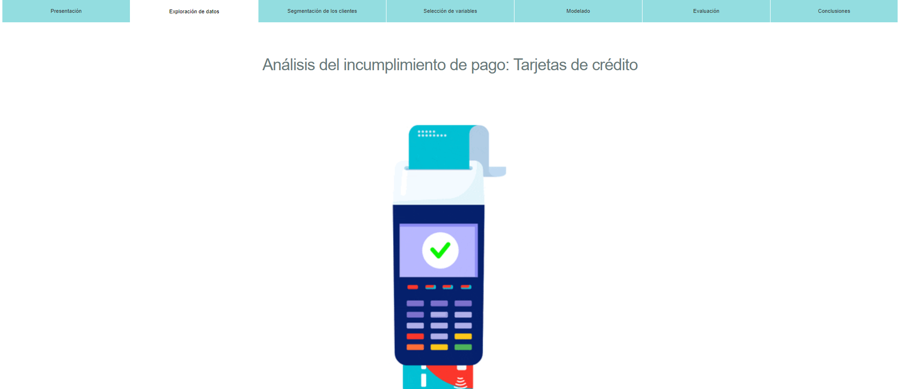
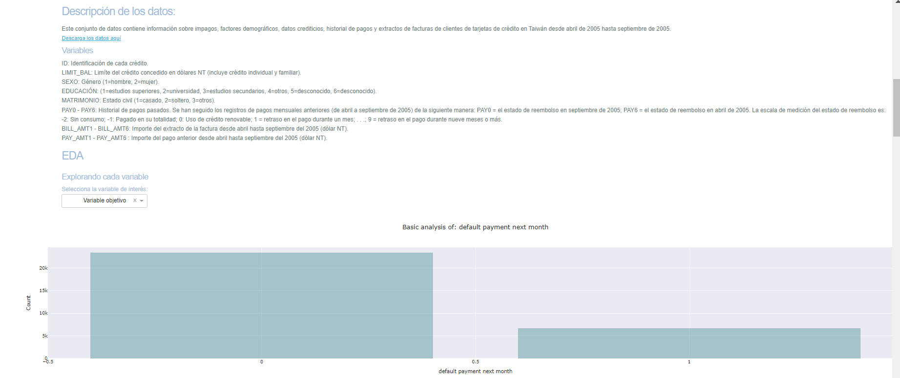

# Disaster Response Pipeline Project

In this project, an application was built to classify messages given by the user in one of the 36 categories. The algorithms used are Catboots, the metric used to evaluate each model was the AUC. On the other hand, it was found that some of the classes were too unbalanced, so to avoid overfitting in these algorithms, balancing techniques were used, in this case SMOTE.

## Link para la aplicacion web https://defaultappnataliacastilla.herokuapp.com/

## Sobre este repositorio
En este repositorio encontrarás todo lo necesario para reproducir mi trabajo

* notebooks: Encontrarás el código para reproducir todo.
* models: Están todos los modelos realizados
* imgs: Se encuentran todas las imágenes realizadas tanto en la exploración, preprocesamiento y clusterización
* data: Fuente de datos empleada: https://archive.ics.uci.edu/ml/datasets/default+of+credit+card+clients

## Model and results

Thirty-six classifiers were developed, using the Catboost algorithm. The lower metric was 0.70 
 and the upper metric was 0.93 AUC. You can check the results running the models (Please see the instructions).

### Instructions:

1. Run the following commands in the project's root directory to set up your database and model.

    - To run ETL pipeline that cleans data and stores in database
        `python data/process_data.py data/disaster_messages.csv data/disaster_categories.csv data/DisasterResponse.db`
    - To run ML pipeline that trains classifier and saves
        `python models/train_classifier.py data/DisasterResponse.db models/models_clfs/ models/glove.6B.50d.txt`
    - *Please uncompress the file with glove embedding to running the models*
 
 
2. Run the following command in the app's directory to run your web app.
    `python app/run.py` or python/disaster_response_app.py

3. Go to http://0.0.0.0:3001/

## Prerequisites

To install the flask app, you need:

* python3
* python packages in the requirements.txt file

Install the packages with

* pip install -r requirements.txt

## Acknowledgements
Thanks to Davivienda to support me through this course
